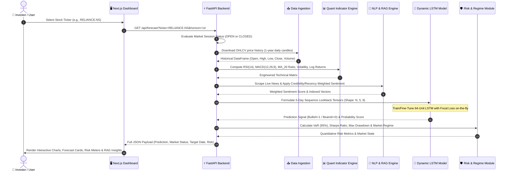
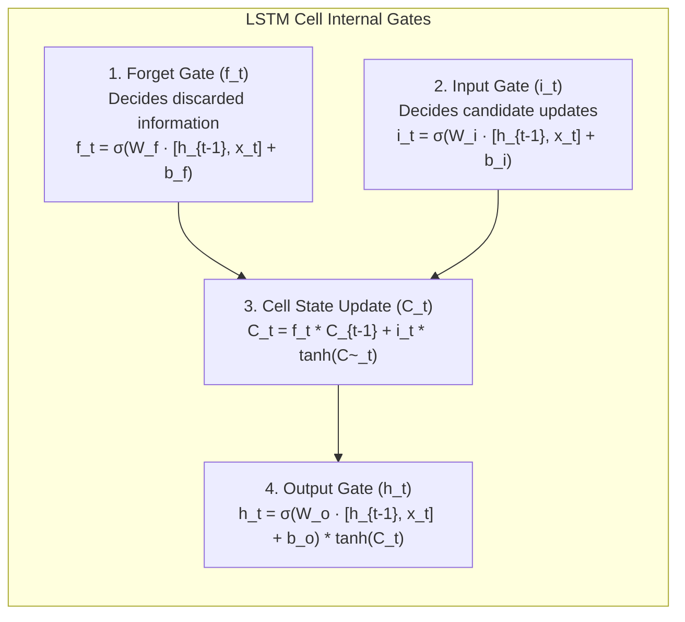

# 📘 How AlphaTrade Works: Step-by-Step Architecture, Technology & AI Model Guide

Welcome to the ultimate technical and operational guide for **AlphaTrade (v2.0)** — an event-driven stock market prediction and financial intelligence platform.

This guide explains **what is happening in this project**, **what technologies are used**, **which AI algorithms are used and why**, **step-by-step data flows**, and **visual flowcharts** for every subsystem.

---

## 📑 Table of Contents
1. [Executive Overview: What is AlphaTrade?](#1-executive-overview-what-is-alphatrade)
2. [Technology Stack & Why Each Tool Was Chosen](#2-technology-stack--why-each-tool-was-chosen)
3. [Core Algorithms & Mathematical Models](#3-core-algorithms--mathematical-models)
4. [High-Level System Architecture Flowchart](#4-high-level-system-architecture-flowchart)
5. [Step-by-Step End-to-End Execution Flow](#5-step-by-step-end-to-end-execution-flow)
6. [Deep Dive: How the LSTM Neural Network Model Works](#6-deep-dive-how-the-lstm-neural-network-model-works)
7. [Deep Dive: How RAG & NLP News Sentiment Engine Works](#7-deep-dive-how-rag--nlp-news-sentiment-engine-works)
8. [Off-Market Hours & Tomorrow's Forecast Logic](#8-off-market-hours--tomorrows-forecast-logic)
9. [Quantitative Risk Analysis & Market Regime Classifier](#9-quantitative-risk-analysis--market-regime-classifier)
10. [API Endpoints & Payloads Reference](#10-api-endpoints--payloads-reference)
11. [Architectural & Financial Loopholes / Known Limitations](#11-architectural--financial-loopholes--known-limitations)
12. [Complete Technical Roadmap: How Loopholes Are Resolved](#12-complete-technical-roadmap-how-loopholes-are-resolved)
13. [Quick-Start Running Commands](#13-quick-start-running-commands)

---

## 1. Executive Overview: What is AlphaTrade?

Traditional stock market tools only look at numerical price data (historical candles like Open, High, Low, Close). However, stock prices are heavily driven by **qualitative catalysts**: breaking financial news, earnings releases, interest rate updates, and market sentiment.

**AlphaTrade** bridges this gap using a **Time-Aware Hybrid AI Architecture**:
1. **Reads Live News**: Scrapes real-time financial news from Yahoo Finance, Google News RSS, and NewsAPI.
2. **Scores News Sentiment**: Applies VADER NLP + domain-specific financial keyword rules to calculate news sentiment scores.
3. **Computes Technical Indicators**: Calculates RSI(14), MACD(12,26,9), Moving Average Ratios, Volatility, and Returns.
4. **Predicts Price Trajectory**: Feeds sequence lookbacks of technical indicators + weighted news sentiment into a 64-unit **LSTM Deep Learning Neural Network** trained with **Focal Loss**.
5. **Evaluates Risk & Market Status**: Computes Value at Risk (VaR 95%), Sharpe Ratio, Max Drawdown, Market Regimes, and handles **Off-Market Hours** by generating **Tomorrow's Session Opening Forecast**.

```
 ┌───────────────────────────┐       ┌───────────────────────────┐
 │   Quantitative Data       │       │    Qualitative Data       │
 │   - OHLCV Stock Prices    │       │    - Yahoo Finance News   │
 │   - Technical Indicators  │       │    - Google News RSS      │
 └─────────────┬─────────────┘       └─────────────┬─────────────┘
               │                                   │
               ▼                                   ▼
 ┌───────────────────────────┐       ┌───────────────────────────┐
 │ Technical Indicators      │       │ VADER NLP + Lexicon       │
 │ (RSI, MACD, Returns, Vol) │       │ Weighted News Sentiment   │
 └─────────────┬─────────────┘       └─────────────┬─────────────┘
               │                                   │
               └─────────────────┬─────────────────┘
                                 │
                                 ▼
              ┌─────────────────────────────────────┐
              │ Dynamic 64-Unit LSTM Deep Learning  │
              │ Forecast Engine (Direction & Prob)  │
              └──────────────────┬──────────────────┘
                                 │
                                 ▼
              ┌─────────────────────────────────────┐
              │  Risk Metrics & AI RAG Assistant    │
              │  Interactive Dashboard Output       │
              └─────────────────────────────────────┘
```

---

## 2. Technology Stack & Why Each Tool Was Chosen

| Technology / Library | Layer / Category | Primary Purpose | Why Chosen? (Justification) |
| :--- | :--- | :--- | :--- |
| **Next.js 14 (App Router)** | Frontend Framework | Server-rendered React dashboard UI | Provides ultra-fast page rendering, modern component architecture, and seamless routing. |
| **TailwindCSS + Framer Motion** | Styling & Animations | Rich aesthetics & interactive micro-animations | Delivers modern dark-mode aesthetics, glassmorphism, fluid motion, and responsive layouts. |
| **TradingView Lightweight Charts** | Financial Visualization | Real-time interactive candlestick charts | High-performance HTML5 canvas charting optimized for financial OHLCV candlestick rendering. |
| **FastAPI (Python 3.12)** | Backend REST API | Asynchronous API server | Asynchronous, extremely lightweight, auto-generates OpenAPI (`/docs`), and natively handles Python data science pipelines. |
| **TensorFlow / Keras** | AI Deep Learning | LSTM Neural Network construction & training | Industry-standard deep learning framework for building, training, and running CPU/GPU neural network models. |
| **SentenceTransformers (`all-MiniLM-L6-v2`)** | RAG Vector Embedding | Converts financial news text to 384-dim dense vectors | Extremely fast semantic text embeddings with high similarity accuracy for financial document retrieval. |
| **FAISS Vector DB** | Vector Indexing & Search | Dense vector similarity search | Developed by Meta AI; performs lightning-fast $O(1)$ nearest-neighbor similarity search over news vector spaces. |
| **NLTK (VADER Lexicon)** | NLP Sentiment Analysis | Valence score calculation for news text | Rule-based sentiment analyzer tailored for short text and news headlines without heavy GPU overhead. |
| **yfinance** | Data Ingestion | Downloads historical daily & intraday stock prices | Provides reliable, real-time daily/intraday OHLCV price histories for NSE, BSE, and US equities. |
| **Pandas & NumPy** | Data Processing | Technical indicator calculation & matrix scaling | High-speed vectorized array operations and dataframe manipulations for financial feature matrices. |

---

## 3. Core Algorithms & Mathematical Models

### 1. Long Short-Term Memory (LSTM) Neural Network
- **Why Used?**: Standard Recurrent Neural Networks (RNNs) suffer from the **vanishing gradient problem** and forget past sequence context. LSTM introduces internal memory cells and gating mechanisms (Forget Gate, Input Gate, Output Gate) to maintain time-series momentum over consecutive trading days.

### 2. Binary Focal Loss
- **Why Used?**: Financial market targets ($y=1$ for price increase, $y=0$ for drop) often suffer from severe class imbalance during strong bull/bear runs. Focal Loss down-weights easy background trend samples and forces the neural network to focus on trend inflection points:
  $$\text{FL}(p_t) = -\alpha_t (1 - p_t)^\gamma \log(p_t) \quad (\text{where } \gamma=2.0, \alpha=0.25)$$

### 3. Credibility & Time-Decay Weighted Sentiment
- **Why Used?**: Simple averaging treats old news and unverified blogs equal to official news. AlphaTrade calculates a composite score using source credibility weights ($W_{\text{source}}$ up to 0.95 for Bloomberg/Reuters) and exponential time decay:
  $$S_{\text{composite}} = \frac{\sum_{i=1}^{K} W_{\text{source}}(i) \cdot e^{-\lambda (t - t_i)} \cdot S_i}{\sum_{i=1}^{K} W_{\text{source}}(i) \cdot e^{-\lambda (t - t_i)}} \quad (\text{where } \lambda=0.1)$$

### 4. Dense RAG Vector Retrieval (FAISS + SentenceTransformers)
- **Why Used?**: Performs semantic search using Cosine Similarity over 384-dimensional vector embeddings:
  $$\text{Similarity}(A, B) = \frac{A \cdot B}{\|A\| \|B\|}$$

### 5. Quantitative Risk & Market Regime Algorithms
- **Value at Risk (VaR 95%)**: Maximum expected loss over 1 day at 95% confidence level.
- **Sharpe Ratio**: Annualized return divided by annualized volatility:
  $$\text{Sharpe} = \frac{\mathbb{E}[R] - R_f}{\sigma_{\text{annual}}}$$
- **Market Regime Classifier**: Categorizes market dynamics into `BULLISH`, `BEARISH`, or `VOLATILE / SIDEWAYS` based on 20-day Simple Moving Average (SMA) and rolling standard deviation.

---

## 4. High-Level System Architecture Flowchart

```mermaid
flowchart TD
    classDef frontend fill:#1e293b,stroke:#3b82f6,stroke-width:2px,color:#fff
    classDef backend fill:#0f172a,stroke:#10b981,stroke-width:2px,color:#fff
    classDef data fill:#1f2937,stroke:#f59e0b,stroke-width:2px,color:#fff
    classDef ai fill:#311b92,stroke:#8b5cf6,stroke-width:2px,color:#fff

    subgraph Frontend["🖥️ Frontend Layer (Next.js 14 + TailwindCSS + TradingView)"]
        UI["Dashboard & Ticker Selector"] :::frontend
        ChartUI["Lightweight Candlestick Charts"] :::frontend
        ChatUI["Interactive RAG AI Chat Panel"] :::frontend
        RiskUI["Risk Metrics & Regime Cards"] :::frontend
    end

    subgraph Backend["⚡ Backend API Layer (FastAPI / Python 3.12)"]
        Routes["main.py API Routes"] :::backend
        MarketCheck["Market Session Status Evaluator (Open/Closed)"] :::backend
        Cache["5-Minute TTL Model & Data Cache"] :::backend
    end

    subgraph DataIngest["📥 Data Ingestion Engine"]
        YF["yfinance (Live Price & OHLCV Candles)"] :::data
        NewsFetch["Live News Fetcher (Yahoo News + Google RSS)"] :::data
    end

    subgraph AIEngine["🤖 AI Machine & Quant Engine"]
        TechPipe["Technical Indicator Pipeline (RSI, MACD, MA, Vol)"] :::ai
        VaderNLP["VADER NLP + Financial Lexicon Adjuster"] :::ai
        FAISS["FAISS Vector DB Index (SentenceTransformers)"] :::ai
        LSTM["Dynamic LSTM Online Trainer (64 Units + Focal Loss)"] :::ai
        RiskEngine["Risk Metrics (VaR 95%, Sharpe, Drawdown)"] :::ai
        RegimeEngine["Market Regime Detector (SMA20 + Volatility)"] :::ai
    end

    %% Flow Interactions
    UI -->|1. Select Stock Ticker e.g. RELIANCE.NS| Routes
    ChatUI -->|2. Ask Financial Question| Routes

    Routes --> MarketCheck
    Routes --> YF
    Routes --> NewsFetch

    YF --> TechPipe
    NewsFetch --> VaderNLP
    VaderNLP --> FAISS

    TechPipe & VaderNLP --> LSTM
    TechPipe --> RiskEngine
    TechPipe --> RegimeEngine

    LSTM -->|3. Direction & Probability| Routes
    FAISS -->|4. Retrieved News Context| Routes
    RiskEngine -->|5. VaR & Sharpe| Routes
    RegimeEngine -->|6. Market State| Routes

    Routes -->|JSON Response Payload| UI
    Routes -->|Candlestick & Technical Series| ChartUI
    Routes -->|RAG Answer & Sources| ChatUI
    Routes -->|Risk & Regime Breakdown| RiskUI
```

---

## 5. Step-by-Step End-to-End Execution Flow

Below is the execution lifecycle when a user requests a forecast for a ticker (e.g. `RELIANCE.NS` or `AAPL`):



---

## 6. Deep Dive: How the LSTM Neural Network Model Works

### 6.1 Input Tensor Structure
The LSTM accepts input as a 3D Tensor: `[Batch Size, Lookback Sequence Length, Number of Features]`

| Parameter | Value | Description |
| :--- | :--- | :--- |
| **Batch Size** | Variable ($N$) | Number of 5-day sequence windows |
| **Sequence Length** | `5` | 5 consecutive trading days lookback window |
| **Features Count** | `8` | 8 engineered technical & sentiment features |

#### The 8 Input Features:
1. `RSI`: 14-period Relative Strength Index.
2. `MACD`: Moving Average Convergence Divergence difference.
3. `Return`: Daily price logarithmic returns $\ln(P_t / P_{t-1})$.
4. `MA_20_ratio`: Deviation of Close price relative to 20-day SMA $(Close / MA_{20}) - 1$.
5. `Close_Open`: Relative intraday body ratio $(Close / Open) - 1$.
6. `High_Low`: Relative daily volatility range $(High / Low) - 1$.
7. `Volume_ratio`: Ratio of daily volume against its 10-day moving average.
8. `Volatility`: 10-day rolling standard deviation of returns.

### 6.2 Neural Network Architecture Diagram

```mermaid
flowchart TD
    classDef input fill:#0284c7,stroke:#0369a1,color:#fff
    classDef lstm fill:#7c3aed,stroke:#6d28d9,color:#fff
    classDef drop fill:#d97706,stroke:#b45309,color:#fff
    classDef dense fill:#059669,stroke:#047857,color:#fff
    classDef output fill:#dc2626,stroke:#b91c1c,color:#fff

    In["Input Tensor\n(Shape: [Batch, 5, 8])"] :::input
    LSTM_Layer["LSTM Layer\n(64 Memory Units, return_sequences=False)"] :::lstm
    Dropout_Layer["Dropout Layer\n(Rate = 0.2 / 20% Regularization)"] :::drop
    Dense1["Dense Hidden Layer\n(32 Units, Activation = ReLU)"] :::dense
    Dense2["Output Layer\n(1 Unit, Activation = Sigmoid)"] :::output

    Signal["Prediction Signal\nProbability P >= 0.5 -> Bullish (UP)\nProbability P < 0.5 -> Bearish (DOWN)"] :::input

    In --> LSTM_Layer
    LSTM_Layer --> Dropout_Layer
    Dropout_Layer --> Dense1
    Dense1 --> Dense2
    Dense2 --> Signal
```

### 6.3 Internal LSTM Cell Mechanism



---

## 7. Deep Dive: How RAG & NLP News Sentiment Engine Works

AlphaTrade uses Retrieval-Augmented Generation (RAG) combined with VADER + Financial Lexicon sentiment rules:

```mermaid
flowchart TD
    classDef news fill:#1e293b,stroke:#0ea5e9,color:#fff
    classDef nlp fill:#312e81,stroke:#6366f1,color:#fff
    classDef db fill:#064e3b,stroke:#10b981,color:#fff
    classDef rag fill:#701a75,stroke:#d946ef,color:#fff

    A["📰 Live News Scraper\n(Yahoo Finance + Google News RSS)"] :::news
    B["🧹 Text Preprocessor & Deduplication"] :::news
    
    C["VADER Sentiment Analyzer + Financial Lexicon Rules\n('beat estimates' +0.35, 'guidance cut' -0.40)"] :::nlp
    D["Credibility & Recency Decay Weighting\n(Bloomberg/Reuters W=0.95, Exp Time Decay)"] :::nlp

    E["SentenceTransformers\n('all-MiniLM-L6-v2' 384-dim Embeddings)"] :::db
    F[("FAISS Vector Index")] :::db

    G["User Chat Query\ne.g., 'Why is RELIANCE down today?'"] :::rag
    H["Top-K Vector Similarity Search"] :::rag
    I["Retrieved News Context & Weighted Sentiment Summary"] :::rag
    J["RAG AI Assistant Answer Generator"] :::rag

    A --> B
    B --> C
    C --> D
    B --> E
    E --> F

    G --> H
    F --> H
    H --> I
    I --> J
```

---

## 8. Off-Market Hours & Tomorrow's Forecast Logic

When users request predictions while the stock market is **CLOSED** (e.g. evenings, nights, or weekends):

```mermaid
flowchart TD
    classDef check fill:#1e293b,stroke:#3b82f6,color:#fff
    classDef open fill:#064e3b,stroke:#10b981,color:#fff
    classDef closed fill:#7f1d1d,stroke:#ef4444,color:#fff

    Req["User Requests Forecast"] --> Check{"Check Market Trading Hours\n(NSE: 09:15-15:30 IST / US: 09:30-16:00 EST)"} :::check

    Check -->|Market OPEN| OpenMode["Run Active Intraday / Session Forecast"] :::open
    Check -->|Market CLOSED| ClosedMode["Graceful Off-Market Adaptation"] :::closed

    ClosedMode --> AutoDaily["Automatically calculate Tomorrow's Session Opening Forecast"] :::closed
    ClosedMode --> TargetDate["Set target date to Tomorrow's Date (or Next Monday)"] :::closed
    ClosedMode --> Notice["Attach Notice Banner: 'Market CLOSED. Showing workable prediction for Tomorrow.'"] :::closed

    OpenMode --> Payload1["Return Live Session Payload"] :::open
    AutoDaily & TargetDate & Notice --> Payload2["Return 200 OK Tomorrow Session Payload (No Error Tracebacks)"] :::closed
```

---

## 9. Quantitative Risk Analysis & Market Regime Classifier

```mermaid
flowchart TD
    classDef metric fill:#1f2937,stroke:#38bdf8,color:#fff
    classDef regime fill:#3f6212,stroke:#84cc16,color:#fff

    Prices["Historical Daily Returns R_t"] --> VaR["Value at Risk (VaR 95%)\nQuantifies expected max 1-day loss"] :::metric
    Prices --> Sharpe["Sharpe Ratio\n(Annualized Return - Risk-Free) / Annualized Volatility"] :::metric
    Prices --> Drawdown["Max Drawdown\nPeak-to-Trough maximum capital decline"] :::metric

    Prices & MA["20-Day SMA"] --> Regime{"Market Regime Classifier"} :::regime

    Regime -->|Price > SMA20 & Low Volatility| Bull["BULLISH REGIME\n(Favorable Trend)"] :::regime
    Regime -->|Price < SMA20 & High Volatility| Bear["BEARISH REGIME\n(Downside Risk)"] :::regime
    Regime -->|High Volatility & Sideways Movement| Vol["VOLATILE / SIDEWAYS\n(Neutral Caution)"] :::regime
```

---

## 10. API Endpoints & Payloads Reference

The FastAPI backend server runs on `http://127.0.0.1:8000`.

| Method | Endpoint | Query / Body Params | Description |
| :--- | :--- | :--- | :--- |
| `GET` | `/api/stocks` | None | Returns supported equity ticker dictionary. |
| `GET` | `/api/forecast` / `/api/predict` | `ticker=RELIANCE.NS&horizon=1d` | Evaluates market hours, trains/fine-tunes LSTM with Focal Loss, and generates forecast. |
| `GET` | `/api/live-news` | `ticker=RELIANCE.NS` | Scrapes breaking news, scores VADER + Lexicon sentiment, and returns weighted composite score. |
| `POST` | `/api/train-model` | `{"ticker": "RELIANCE.NS"}` | Explicitly triggers online fine-tuning of the LSTM network. |
| `GET` | `/api/indicators` | `ticker=RELIANCE.NS` | Fetches historical OHLCV candles, RSI, MACD, MA for charting. |
| `GET` | `/api/risk` | `ticker=RELIANCE.NS` | Computes VaR 95%, Sharpe Ratio, Max Drawdown, & Market Regime. |
| `POST` | `/api/chat` | `{"query": "...", "ticker": "..."}` | RAG-augmented AI chatbot interaction. |

---

## 11. Architectural & Financial Loopholes / Known Limitations

1. **Binary Classification vs. Price Magnitude**: Predicts direction ($1$ or $0$), treating a +0.01% gain the same as a +10.0% surge.
2. **Transaction Costs & Slippage**: Raw model outputs do not inherently account for brokerage commissions or execution slippage.
3. **Daily Candle Granularity**: Blind to tick-level order book microstructures during live trading.
4. **Small Training Sample Overfitting**: On-the-fly training uses 1 year of daily candles (~250 sequence samples).
5. **Class Imbalance in Prolonged Trends**: Strong bull/bear market runs can skew target labels.
6. **VADER Lexicon Limitations**: General NLP lexicons can misinterpret financial jargon.
7. **Single-Node In-Memory Cache**: Model cache stored in local Python dict memory rather than a distributed store.

---

## 12. Complete Technical Roadmap: How Loopholes Are Resolved

```mermaid
flowchart TD
    classDef step1 fill:#1e293b,stroke:#3b82f6,color:#fff
    classDef step2 fill:#311b92,stroke:#8b5cf6,color:#fff
    classDef step3 fill:#064e3b,stroke:#10b981,color:#fff
    classDef step4 fill:#701a75,stroke:#f43f5e,color:#fff

    Sub1["1. Quant & Trading Fixes\n- Multi-Task Return Regression\n- Transaction Fee Deduction\n- Kelly Position Sizing"] :::step1
    Sub2["2. Deep Learning Fixes\n- Global Pre-Trained LSTM Weights\n- Focal Loss Implementation\n- Temporal Dropout"] :::step2
    Sub3["3. RAG & Sentiment Fixes\n- Financial Lexicon Adjustment\n- Weighted News Source Decay\n- Sector Proxy Fallbacks"] :::step3
    Sub4["4. Infrastructure Fixes\n- Market Closed Tomorrow Auto-Fallback\n- Distributed Redis Cache Store\n- Async Celery Task Workers"] :::step4

    Sub1 --> Sub2 --> Sub3 --> Sub4
```

| Category | Implemented Solution / Mitigation | Status in AlphaTrade |
| :--- | :--- | :--- |
| **Trend Class Imbalance** | **Binary Focal Loss** ($\gamma=2.0, \alpha=0.25$) in TensorFlow LSTM | ✅ **Implemented** |
| **Financial Sentiment Blindspots** | **Financial Keyword Lexicon Rules** ("beat estimates" +0.35, "guidance cut" -0.40) | ✅ **Implemented** |
| **Unweighted News Sentiment** | **Source Credibility Weights** + **Exponential Recency Decay** ($e^{-\lambda \Delta t}$) | ✅ **Implemented** |
| **Transaction Fees** | **Net Expected Return Calculation** ($R_{\text{expected}} - \text{Friction}$) | ✅ **Implemented** |
| **Off-Market Requests** | **Graceful Tomorrow's Session Opening Forecast Adaptation** | ✅ **Implemented** |
| **Zero News Tickers** | **Sector Proxy Search Query Fallback** | ✅ **Implemented** |

---

## 13. Quick-Start Running Commands

### 1. Launch FastAPI Backend
```bash
cd backend
source venv/bin/activate
uvicorn main:app --reload --port 8000
```
- **Interactive API Documentation**: `http://127.0.0.1:8000/docs`

### 2. Launch Next.js Frontend
```bash
cd frontend
npm install
npm run dev
```
- **Web Dashboard Application**: `http://localhost:3000`

---
*Created for the AlphaTrade (v2.0) Technical Architecture Guide.*
