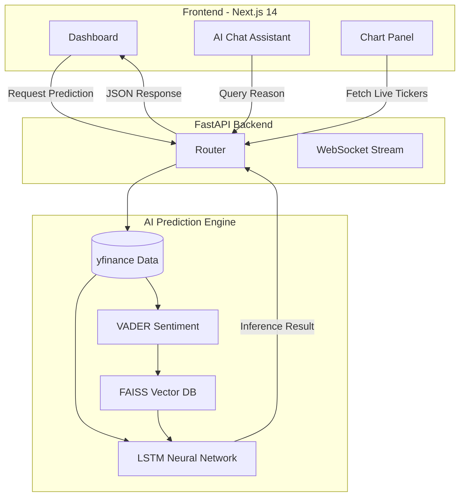

<div align="center">
  

  <br />
  <br />

  # 📈 AlphaTrade: Predictive Intelligence v2.0
  **EVENT-DRIVEN STOCK MARKET PREDICTION SYSTEM USING RAG-LSTM**
  
  <p align="center">
    <a href="#problem-statement">Problem</a> •
    <a href="#why-AlphaTrade">Why AlphaTrade?</a> •
    <a href="#technologies">Tech Stack</a> •
    <a href="#system-architecture">Architecture</a> •
    <a href="#getting-started">Installation</a>
  </p>
</div>

---

## 🛑 Problem Statement
In today's highly volatile financial markets, retail investors are at a massive disadvantage. Institutional trading firms utilize complex, event-driven algorithms that can instantly digest global news and adjust quantitative models. Retail investors, on the other hand, are forced to rely on lagging technical indicators (like moving averages) that only tell you what *has* happened, not what *will* happen based on real-time semantic catalysts. 

## ⚖️ Existing Solutions vs. AlphaTrade
**Existing Solutions:**
* Rely purely on historical price data (ARIMA, basic LSTMs).
* Ignore qualitative data like breaking news, earnings reports, and central bank announcements.
* Offer cluttered, non-intuitive User Interfaces.

**What's Different in AlphaTrade:**
AlphaTrade bridges the gap by introducing a **Time-Aware Hybrid Architecture**. We don't just look at the price; we read the news. By combining **RAG (Retrieval-Augmented Generation)** with **LSTM Neural Networks**, the system contextualizes time-series price action with real-world semantic data, mimicking how a human analyst evaluates a stock.

## 💎 Why it is Better
1. **Institutional-Grade Interface:** A bespoke, dark-mode Next.js 14 dashboard engineered with true glassmorphism, cinematic ambient lighting, and lightweight-charts for ultra-smooth rendering.
2. **Semantic Intelligence (RAG):** Uses FAISS vector databases and NLP to retrieve and score the most impactful financial news relevant to the current timeframe.
3. **Deep Learning Forecasting:** A highly tuned Long Short-Term Memory (LSTM) network processes the RAG sentiment alongside quantitative technicals to predict short-term trajectories.
4. **Interactive AI Assistant:** A built-in chatbot that can explain exactly *why* the model made a specific prediction based on the retrieved documents.

---

## 📸 Platform Screenshots

> **Note:** Screenshots are located in the `assets/` directory.

| Landing Page | Main Dashboard (Overview) |
| :---: | :---: |
|  |  |
| *Cinematic entry point.* | *Live lightweight-charts and KPIs.* |

| Technical Indicators | AI Chat Assistant |
| :---: | :---: |
|  |  |
| *RSI, MACD, and Bollinger Bands.* | *RAG-powered conversational interface.* |

---

## 🛠️ Technologies Used

### Frontend (User Interface)
* **Framework:** Next.js 14 (App Router)
* **Styling:** TailwindCSS, Framer Motion
* **Charting:** Lightweight Charts (TradingView)
* **State Management:** Zustand
* **Typography:** Outfit & JetBrains Mono

### Backend (AI & Prediction Engine)
* **API:** FastAPI (Python)
* **Deep Learning:** PyTorch (LSTM models)
* **NLP & Vector DB:** FAISS, NLTK/VADER (Sentiment Analysis)
* **Data Ingestion:** yfinance (Real-time NSE Data)

---

## 🧠 System Architecture



---

## 📂 File Structure

```text
stock_market_prediction/
├── backend/                  # FastAPI & AI Engine
│   ├── api/                  # REST endpoints
│   ├── models/               # PyTorch LSTM definitions
│   ├── rag/                  # Vector embeddings & FAISS logic
│   ├── data_ingestion/       # Live market data fetchers
│   └── main.py               # Uvicorn entry point
├── frontend/                 # Next.js 14 Dashboard
│   ├── src/
│   │   ├── app/              # App Router (pages)
│   │   ├── components/       # Reusable UI (Charts, Cards)
│   │   └── store/            # Zustand global state
│   ├── tailwind.config.ts    # Design tokens
│   └── package.json          # Node dependencies
├── docker-compose.yml        # Production deployment config
└── README.md                 # Project documentation
```

---

## 🚀 Getting Started

### 1. Start the Backend
```bash
# Navigate to project root
cd stock_market_prediction

# Activate Virtual Environment (Windows)
.\venv\Scripts\activate

# Install dependencies (if not already installed)
pip install -r backend/requirements.txt

# Launch FastAPI Server
cd backend
python -m uvicorn main:app --reload --port 8000
```

### 2. Start the Frontend
Open a new terminal window:
```bash
cd frontend

# Install dependencies
npm install

# Run the development server
npm run dev
```

The application will be running at `http://localhost:3000`.

---
<div align="center">
  <i>Engineered for the future of decentralized and AI-driven quantitative finance.</i>
</div>
